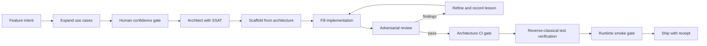

# ForgeLine 🔨

**The autonomous outer loop for AI software factories.** ForgeLine is the tier
above spec-writing and code-generation: a **CLI-backed state machine** that
carries a feature from vague intent to shipped code through confidence gates,
runs a generate → **adversarial review** → refine loop, enforces
**architecture as a hard CI gate**, and gets smarter every run via an evolving
skill memory.

It orchestrates its siblings — [SpecLine](../specline) (spec governance) and
[Harness Software Factory](../harness-factory) (compiled decisions) — into one
pipeline you drive from Claude Code or Codex.

> Stop writing the code. Build — and supervise — the machine that writes it.

## Workflow at a glance



```
INTENT ─► EXPAND ─► ARCHITECT(SSAT) ─► SCAFFOLD ─► FILL ─┐
   ▲                                                      │
   │        ┌── grumpy adversary + judge + arch-erosion ──┤
   └── refine┤          (records a skill lesson)           │ pass
             └──────────────◄─────────────────────────────┘
                                     │
                        ARCH-CI-GATE ─► SHIP
```

## Install (any OS, 60 seconds, no API keys)

**One command, works everywhere:**
```bash
python install.py          # Windows / macOS / Linux
```
or double-click `install.sh` (macOS/Linux) / `install.bat` (Windows), or:
```bash
pip install -e ".[dev]"
```

Then:
```bash
forge demo                 # 60-sec: watch it catch its own bad output, learn, ship
forge init
forge agent claude         # wire your agent (see full list below)
forge status <feature>     # the state machine names the ONE next action
forge optimize-pr <feature> # bounded PR hardening loop plan
pytest -q                  # full ForgeLine suite
```

## PR hardening loop

`forge optimize-pr <feature>` is the senior-engineer review loop in executable
form. It reads the current diff, flags paths that require approval, recommends
the QA/lesson/factory evidence commands, and fixes the stop conditions up
front: ready, blocked, approval required, exhausted after five iterations, or
stagnated after no improvement.

ForgeLine still does not merge, publish, deploy, or send external messages by
itself. The loop makes one reversible change at a time, verifies with receipts,
and hands the final proof bundle to Factoryline for `factory pr-pack`.

## Works with every major coding agent

One command wires the entry-point skill wherever your agent reads it:

```bash
forge agent claude      # CLAUDE.md + .claude/skills/forge.md
forge agent codex       # AGENTS.md
forge agent opencode    # AGENTS.md + .opencode/forge.md
forge agent cursor      # .cursorrules + .cursor/rules/forge.md
forge agent aider       # CONVENTIONS.md
forge agent gemini      # GEMINI.md
forge agent windsurf    # .windsurfrules
forge agent generic     # AGENT.md  (unknown tools fall back to AGENTS.md)
```
The contract is plain text; any harness that reads a project file can run the factory.

## What makes it more than a wrapper

**A real state machine with confidence gates.** Eight states, legal-transition
enforcement (`E_ILLEGAL_TRANSITION`), and two **human confidence gates**
(use-case signoff, architecture signoff) where a person must approve before
agents proceed. Every transition is a hash-sealed receipt on disk — so the
loop survives context resets (the disk is the truth).

**SSAT — architecture as code, not a document.** A Semantic Software
Architecture Tree (YAML) declares modules, signatures, allowed dependency
edges, and invariants. The *same artifact* generates the scaffold AND serves
as the CI gate: `check_erosion()` detects signature drift (`E_SIG_DRIFT`),
illegal dependencies (`E_ILLEGAL_DEP`), and invariant violations
(`E_INVARIANT`) — structural erosion caught before merge.

**Scaffolding is fail-closed.** `forge architect` will not overwrite an
existing module. Start with a plan:

```bash
forge architect <feature> <ssat> --dry-run --root .
```

The JSON report separates `created`, `skipped`, `conflicts`, and `overwritten`
files and includes before/after SHA-256 values. Existing targets are reported as
conflicts and leave both the files and feature state unchanged. An intentional
replacement requires `--force`; ForgeLine first writes timestamped backups under
`.forge/scaffold-backups/`, validates every generated file, and restores every
modified target if any replacement fails. Python, TypeScript, and TSX scaffolds
use extension-specific generators and structure checks; unsupported extensions
are rejected rather than receiving Python syntax.

**The grumpy adversary.** A review agent that *assumes your code is broken and
insecure* and makes the generator prove otherwise. Executable heuristics catch
eval/exec/shell-injection/hard-coded-secrets/bare-excepts, and it refuses to
pass any code that ships without tests (`A_NO_PROOF` — "prove it works"). No
LLM required to be useful; an LLM adversary layers behind the same interface.

**A self-improving skill flywheel.** Every gate failure records a structured
lesson to `skills/lessons.jsonl`. Lessons are injected into the next attempt's
context, and lessons seen ≥3 times **graduate into hard constraints**
(conventions-into-constraints) — promoted straight into SSAT invariants. The
factory literally learns your team's rules from its own mistakes.

**Decision handoff to the factory.** Specs carrying a decision table route to
HSF for one-time compilation into gated, deterministic code — the outer loop
knows the difference between *tissue* (agents write it) and *decisions* (the
factory compiles them, never improvised twice).

## The entry-point skill (Claude Code / Codex)

`forge agent claude` writes `CLAUDE.md` + `.claude/skills/forge.md`;
`forge agent codex` writes `AGENTS.md`. The contract turns any agent into a
disciplined factory worker: read the skill, run `forge status`, do the one
named phase, run its gate, repeat — context resetting between phases. The
agent never free-codes; it advances a state machine. That's the whole point.

## Commands

```
forge init                          scaffold the factory
forge adopt <feature> --root .      inspect an existing repo and write a reviewable baseline
forge agent claude|codex            wire the entry-point skill
forge status <feature>              current state + the ONE next action
forge expand <feature>              draft use cases (→ human gate)
forge gate architected <feature>    record explicit architecture approval
forge architect <feature> <ssat> --dry-run  show create/conflict/overwrite plan without writes
forge architect <feature> <ssat>            generate new files; existing files fail closed
forge architect <feature> <ssat> --force    back up then intentionally replace existing targets
forge fill <feature> <ssat>         prove bodies are implemented; enter FILLED
forge review <feature> <ssat>       judge + grumpy adversary + arch erosion (refine loop)
forge arch-gate <feature> <ssat>    architecture CI gate
forge verify-tests <feature> <ssat>  prove smoke checks fail on generated stubs
forge verify-tests-ts <feature>      prove existing TypeScript tests fail on reviewed source mutants
forge challenge <feature> <ssat>     write a Factory Passport challenge receipt
forge smoke <feature>                runtime behavior gate
forge ship <feature>                seal it
forge handoff <feature> <spec>      route decision tables to HSF
forge lessons                       show the skill memory + promotable constraints
forge demo                          the 60-second story
```

## v0.3 — the Intent Thread (PRD → production traceability)

ForgeLine now consumes SpecLine's sealed **Intent Envelope** and verifies the
FINAL shipped code against the ORIGINAL rationalized intent — not the plan, not
the drifted spec, but the intent that was sealed at the plan gate. This closes
the last translation-loss gap: *does the shipped thing actually satisfy what we
rationalized we wanted?*

Every assumption SpecLine surfaced (auth exists, currency is single-source,
dependencies can fail) becomes a **checkable obligation**. The `ship` gate
blocks if the code shows no handling for an assumption the intent depended on,
and the sealed intent hash proves the intent wasn't quietly swapped underneath
the build. Full PRD-to-production traceability, enforced — not documented.

## v0.2 — deeper QA + recursive learning

ForgeLine now audits quality quantitatively and **learns from its own runs**:

**Deep QA audit** (`forge qa`) grades every build on coverage-intent (do tests
actually call the functions?), cyclomatic complexity, a scored security surface
(eval/exec/shell/secrets/weak-crypto), and documentation — a composite A–F grade
that gates shipping. A pretty build with untested, over-complex, or insecure
code cannot pass.

**Recursive learning kernel** (`forge policy`, `forge demo-learning`) closes the
loop the skill memory only started:
- **observe** — a failure is recorded (as before)
- **promote** — a failure seen ≥3× becomes an *enforced active constraint*
- **validate** — when that constraint catches the same failure again, it's marked
  effective; the policy tracks prevention counts
- **self-prune** — a promoted rule that never fires again goes to *probation*, so
  the policy doesn't ossify

The factory's own run history becomes its QA policy, and that policy is measured,
not assumed. `forge demo-learning` shows the full observe→promote→validate→prune
cycle in 15 seconds.

**Escalating refine loop** — the review loop now gets stricter each attempt
(normal → elevated "fix all findings" → final "human review required") instead
of a flat retry cap.

## The five-brick factory

| Repo | Tier | Owns |
|---|---|---|
| **FactoryLine** | proof baseplate | protocol compatibility, traces, passports, challenge aggregation |
| **ForgeLine** | outer loop | intent→ship state machine, adversarial gates, skill flywheel, arch-as-CI |
| **SpecLine** | spec governance | EARS specs, atomic task packets, token-lean context, intent-drift guard |
| **HSF** | decision compiler | ordered business rules → gated deterministic code, zero tokens/decision |
| **Prestige** | design proof | Visual DNA, source audit, rendered desktop/mobile evidence |

Same doctrine at every tier: gate everything, receipts or it didn't happen,
compile what shouldn't be reasoned twice.

## License

Dual-licensed under either **Apache-2.0 OR MIT** at your option — the
permissive standard for broad adoption. Pick whichever your project prefers.

---

## v0.4 — Runtime Smoke Gate (behavior-by-inspection)

ForgeLine's earlier gates all verify code against *specifications* — the judge
checks consistency, the QA audit grades static quality, the intent thread proves
the shipped code honors the sealed envelope. That is correctness *by construction*.

None of it answers the question a per-PR preview deployment answers: **does the
built thing actually RUN and behave correctly?** A change can pass every static
gate and still crash on import or produce the wrong output. v0.4 closes that gap
at solo-builder scale — no ephemeral per-PR environments required.

### New state + gate

The SDLC gains a `SMOKED` state between `ARCH_GATED` and `SHIPPED`:

```
… → reviewed → arch_gated → smoked → shipped
```

`forge smoke <feature>` runs every behavioral check declared in
`smoke/<feature>.json` in an **isolated subprocess with a timeout**, and blocks
ship on any runtime failure. `ship` now refuses to run until the smoke gate has
passed — you cannot ship unverified runtime behavior.

### The smoke manifest

`smoke/<feature>.json` makes "correct runtime behavior" a reviewed artifact:

```json
{
  "checks": [
    {
      "name": "formatter_runtime",
      "kind": "python",
      "run": "from slices.notifier.formatter import format_message\nassert format_message({'kind':'ping','text':'hi'}) == 'ping: hi'\nprint('OK')",
      "expect_exit": 0,
      "expect_stdout": "OK",
      "timeout_s": 15
    }
  ]
}
```

`kind` is `python` (runs a snippet) or `command` (runs a shell command). Each
check asserts an exit code and, optionally, a stdout substring.

### Fail-closed by design

- **No manifest** → BLOCK. You cannot ship runtime behavior you never verified.
- **Empty manifest** → BLOCK. A manifest with zero checks ships nothing verified.
- **Any check fails / times out / crashes** → BLOCK, with the failing check named
  and the last lines of its output captured as a receipt.

### Why this and not full preview deployments

Per-PR ephemeral environments are real DevOps infrastructure (provisioning,
isolation, teardown, secrets, cost) that pays off at *team* scale with many
parallel PRs and human reviewers. The smoke gate captures the core value —
*verify the artifact runs and behaves before merge* — deterministically, at the
cost of a subprocess. When team scale justifies it, the manifest model extends
naturally to spinning real environments; the behavioral contract is already written.
## v0.6 - Reverse-Classical test verification

ForgeLine now refuses tests that prove nothing.

`forge verify-tests <feature> <ssat.yaml>` regenerates the SSAT scaffold into an
isolated temp root and runs every behavioral smoke check against those empty
stubs. Each behavioral check must fail on the stub before ForgeLine trusts it
against the real implementation. A check that passes against an empty stub is
classified as `HOLLOW_TEST` and blocks the feature.

The ordering is now:

```text
... -> reviewed -> arch_gated -> tests_verified -> smoked -> shipped
```

Structural checks such as imports may declare `"must_fail_on_stub": false` in
`smoke/<feature>.json`, but the field defaults to `true`. Omission never buys
leniency, and a manifest where every check is exempt blocks as
`HOLLOW_MANIFEST`.

This gate is deterministic: no model, no git snapshot, no new runtime service.
It reuses the same SSAT scaffold generator as the normal `SCAFFOLDED` state, so
the mutant is the real generated stub.

## Failure attribution and refinement

ForgeLine 0.5 reports review, architecture, QA, smoke, and intent failures at
their smallest actionable unit. `forge qa --root .` includes function-level
metrics and attribution in its JSON output.

The refinement engine accepts exactly one proposed edit at a time. Structural
edits precede configuration and parameter changes. An edit is retained only
when its targeted stage improves and no other stage regresses; rejected edits
are reverted and written with before/after rates to
`.forge/rejection_ledger.jsonl`. Two consecutive non-wins stop the loop.
[](https://github.com/zrk222/code-factory-2-forge/actions/workflows/ci.yaml)
[](https://pypi.org/project/code-factory-2-forge/)
